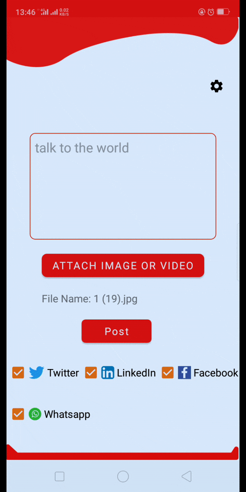
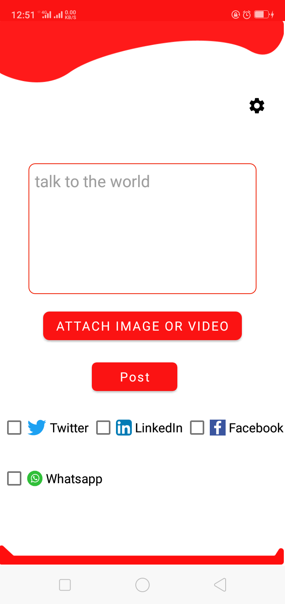
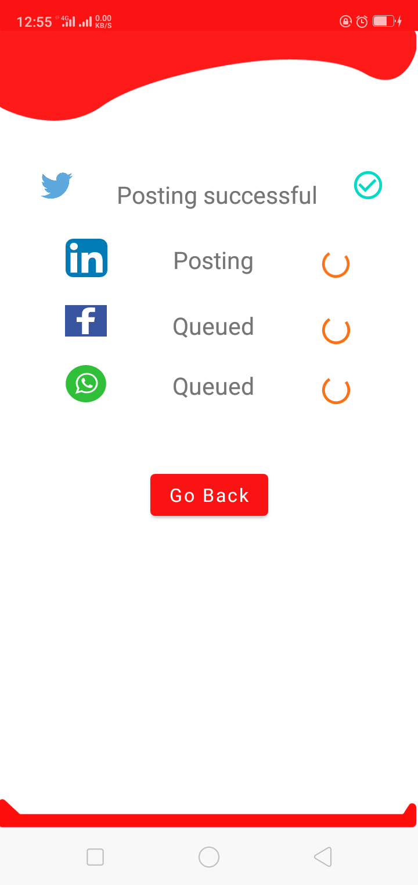
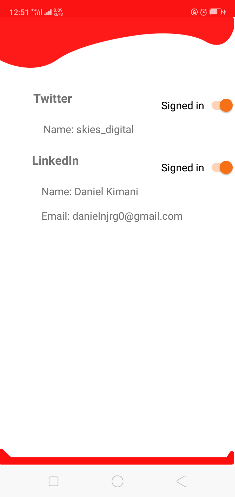

# Joint-Posting-App

Create status updates on twitter, linkedin, facebook and whatsapp from the app. If you like posting across social media platforms without having to go to each platform to post, then this is for you.

## Demo

## Screenshots

&nbsp;&nbsp;&nbsp; &nbsp;&nbsp;&nbsp; 

## Libraries

 - [ ] [Kotlin Coroutines](https://developer.android.com/kotlin/coroutines)
 - [ ] [View Binding](https://developer.android.com/topic/libraries/view-binding)
 - [ ] [Retrofit](https://square.github.io/retrofit/)
 - [ ] [Android Architecture components](https://developer.android.com/topic/libraries/architecture) These include [Rooom persistence library](https://developer.android.com/training/data-storage/room) and [ViewModel](https://developer.android.com/topic/libraries/architecture/viewmodel)

## Instructions for use
Create apps in the individual social media platforms. This can be done in the developer portal of the social media platforms.

Obtain the apps' ids and token secret and in the application.kt file, plug them in there. In the case of facebook insert the app id and secret in the strings.xml file and you will be good to go.

